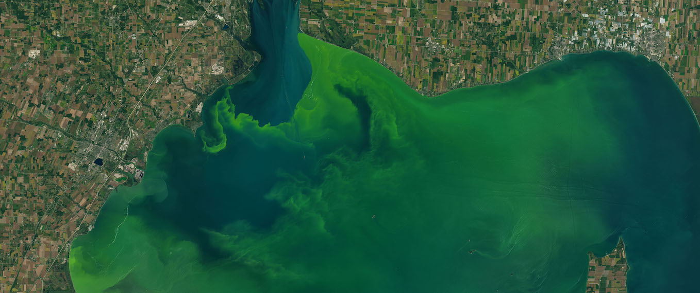

# Tick Tick Bloom: Harmful Algal Bloom Detection Challenge
This repo comes after author's participation in NASA's machine learning competition for cyanobacterial algal bloom severity classification. 




## General
* **Problem statement:** use satellite imagery to detect and classify the severity of cyanobacteria blooms in small, inland water bodies.
* **Type:** Ordinal regression
* **Host:** NASA
* **Platform:** Drivendata
* **Competition link:** https://www.drivendata.org/competitions/143/tick-tick-bloom/
* **Placement:** Top 1% (5/1377)  
* **User Name:** Ouranos  


<br />  


#### **DownLoad Raw data Notebooks**  
[Clima](download_clima_noaahrrr.ipynb)  
[Geomorphology](download_DEM_PlanetaryComputer.ipynb)  
[Satellites Earth Engine](download_satellite_EarthEngine.ipynb)  
[Satellites Planetary Computer](download_satellite_PlanetaryComputer.ipynb)  

<br />   

#### **Make Datasets Notebook**  
[Make Datasets](make_datasets.ipynb)  

<br />  

  

#### **Training and Inference Notebook**

Training and inference pipeline below is a simplified version ranked 6th scoring 0.811 on private LB instead of author's best 5th place.

[v42](lgbmNN_ee_gkf_S_v42g.ipynb)    

<br /> 

## Citing This Work    
**This code has been used in the research paper "AI-driven multi-source data fusion for algal bloom severity classification in small inland water bodies: Leveraging Sentinel-2, DEM, and NOAA climate data". If you find this code useful, please consider citing it.**  

This research was published by [Remote Sensing Applications: Society and Environment](https://www.sciencedirect.com/science/article/pii/S2352938525003532) and It's preprint can be found on [arxiv](https://arxiv.org/abs/2505.03808).  

BibTeX:
```bibtex
@article{nasios2025ai,
  title = {AI-driven multi-source data fusion for algal bloom severity classification in small inland water bodies: Leveraging   Sentinel-2, DEM, and NOAA climate data},
  journal = {Remote Sensing Applications: Society and Environment},
  volume = {40},
  pages = {101800},
  year = {2025},
  issn = {2352-9385},
  author = {Ioannis Nasios}
}
```


<br />  


